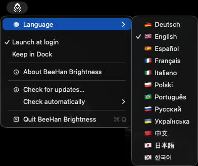

# BeeHan Brightness screenshots

The BeeHan indicator: the ninja in a brightness square, its bar half empty below zero

The BeeHan Brightness menu, with the Language list open

[Back to the README](../../README.md)
